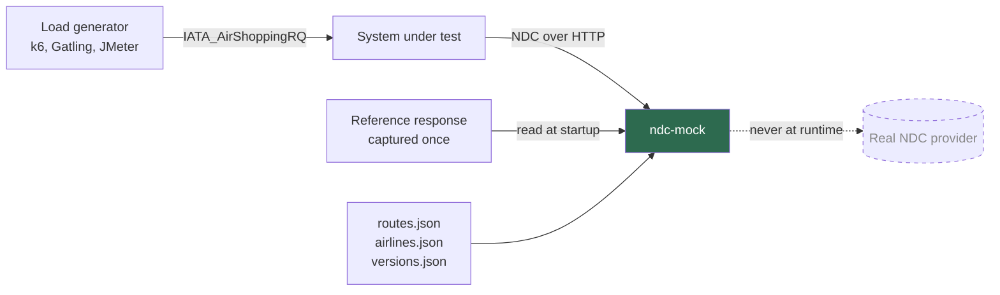
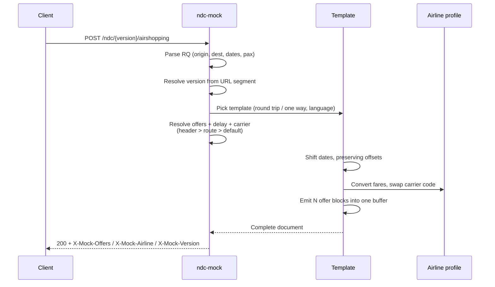
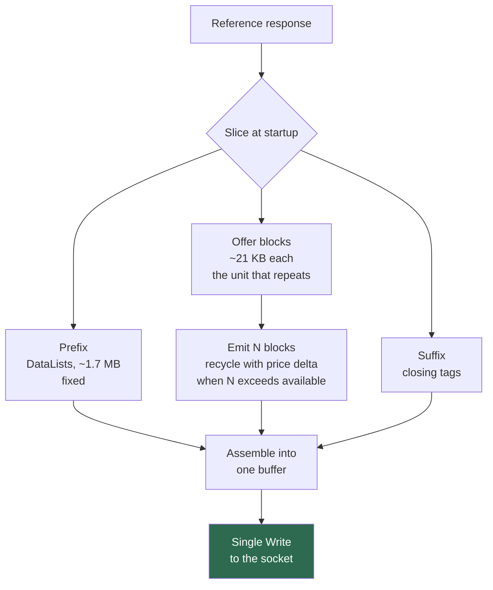
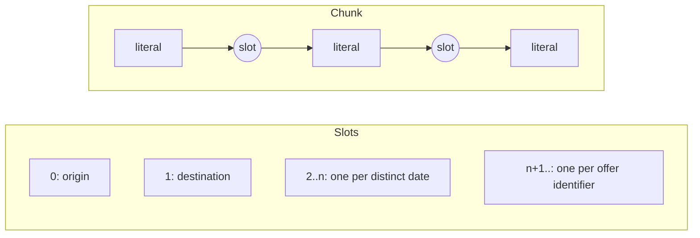
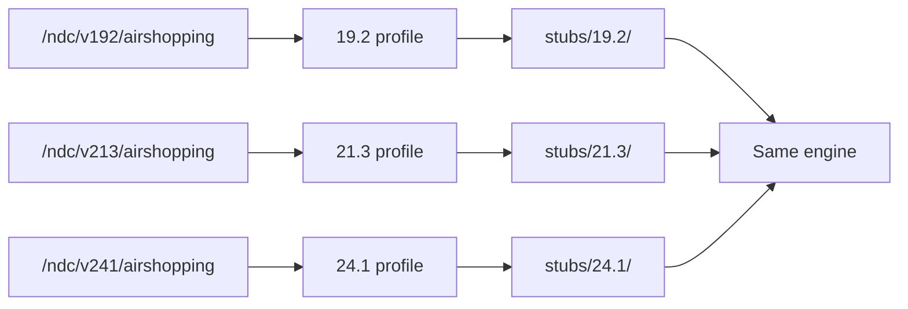
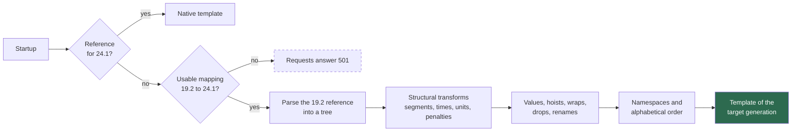
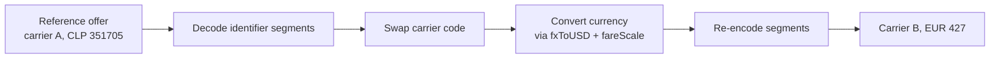

# Architecture

## Where it sits

The mock replaces the airline's NDC provider so a system under test can be driven at load without
an upstream dependency.

The dashed line is the point: one capture teaches the mock the shape of a response, and from then
on there is no upstream call, no credential, no network dependency.

## Request path

## How a response is built

The reference response is sliced once at startup into three zones. Only the offer blocks repeat,
so payload size scales linearly with the requested offer count.

That single write is the whole performance story:

| Strategy | Throughput on a 4.2 MB payload |
|---|---|
| Static, straight from memory | 403 rps |
| Dynamic, 6172 fragments written to the socket | 104 rps |
| Dynamic, assembled then written once | **405 rps** |

Dynamism is free. Syscalls are not.

## Slot model

Every point that varies becomes a numbered slot. The document is stored as alternating literal
spans and slot references, so rendering is a walk with no parsing and no allocation for the
literal parts.

Dates get one slot each rather than a single substitution because they are **not** independent
constants. A reference response contains arrival dates that are one day after departure; if the
requested date moves, those have to move with it. Each date is assigned to the outbound or inbound
leg by proximity and shifted by that leg's delta.

## Version support

The engine works on text markers, not on a schema, so it is version-agnostic. A version profile in
`versions.json` declares only the element names the slicer needs — the offer element and the
identifier elements. Adding a generation is a matter of dropping a reference response into
`stubs/<version>/` and declaring those names.

A version with no reference response present answers **501 naming what is missing**, rather than
quietly serving another generation's payload.

## Version translation

A generation with no reference response of its own is built at startup by translating one we do
have, and from then on it is an ordinary template.

The flow after shopping has no reference: it is built per request as a 19.2 tree and goes through
the same mapping, on a document of a few kilobytes.

Translating the reference once keeps the request path identical for every generation and moves the cost of a
tree to startup, where a few megabytes take milliseconds. It also changes one requirement: the
target's `versions.json` profile names the elements the slicer needs **as they are after
translation**.

Every rule is checked against the official schemas, and the output is validated against them
(`tools/validate-translation.sh`): the reference responses translate into documents that are valid
21.3, 24.1 and 24.4. Name coverage (`X-Mock-Translation-Coverage`) is reported too, as a quick
signal while a new mapping is being built.

## Carrier simulation

Fares keep the **distribution** of the reference response. Real pricing produces a spread across
brands and cabins that is difficult to synthesise convincingly, so the mock preserves the relative
structure and adjusts only currency and magnitude.

What this gives you is *plausible*, not *live*: routes and fares look right for the carrier, but
flight numbers, schedules and availability come from the reference. For load testing that is the
correct trade. For contract testing it is not.

## Limits

- **Only `AirShopping` needs a reference response.** Everything after it is generated from the
  self-describing offer identifier, so those responses are structurally right but carry no real
  fare rules or inventory.
- **Order state is in memory.** It expires, is evicted under pressure and does not survive a
  restart. Across replicas the order identifier names its owner and requests are forwarded there.
- **Multi-city** is served per itinerary shape (`0-1,1-2,2-0`, …) from a reference of that shape;
  any other shape answers `501` naming the shapes that are loaded.
- **Schema validity covers every IATA operation** (AirShopping, OfferPrice, ServiceList,
  SeatAvailability and the order messages) in 19.2, 21.3, 24.1 and 24.4, for the elements the
  references and builders produce; `validate-translation.sh` is the proof. Installments is a
  provider extension outside the schemas.
- **Latency ships uncalibrated at zero.** Set p50~p95 per route and per operation from your own
  observability before benchmarking.
